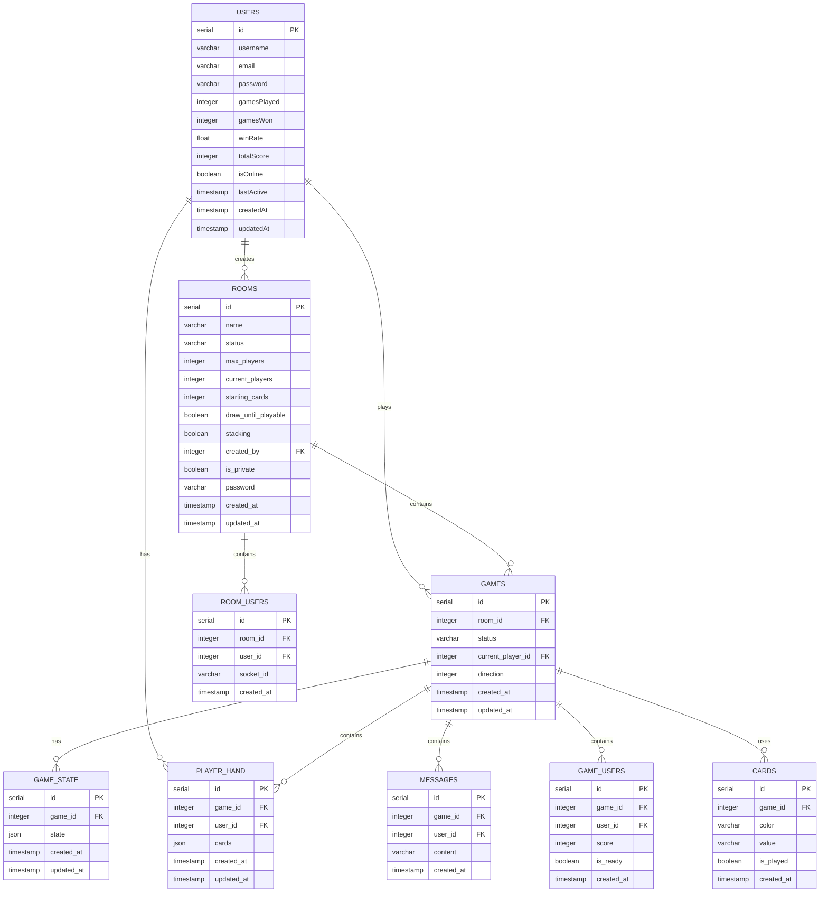

# Database Structure Documentation

## Entity Relationship Diagram (ERD)

## Table Descriptions

### Users Table

- Primary table for user information
- Stores user credentials and game statistics
- Tracks user online status and activity

### Rooms Table

- Manages game rooms
- Stores room settings and configuration
- Tracks room status and player count

### Games Table

- Represents active game sessions
- Links to rooms and tracks game status
- Manages game flow and direction

### Game State Table

- Stores the current state of each game
- Uses JSON format for flexible state storage
- Maintains game history

### Player Hand Table

- Manages cards in each player's hand
- Links players to games
- Stores card information in JSON format

### Messages Table

- Stores in-game chat messages
- Links messages to games and users
- Maintains chat history

### Room Users Table

- Manages player-room relationships
- Tracks socket connections
- Handles room membership

### Game Users Table

- Manages player-game relationships
- Tracks player scores and readiness
- Handles game participation

### Cards Table

- Stores card information for each game
- Tracks card status (played/unplayed)
- Manages card colors and values

## Key Relationships

1. **User Relationships**

   - Users can create multiple rooms
   - Users can participate in multiple games
   - Users can have multiple hands in different games

2. **Room Relationships**

   - Rooms can contain multiple users
   - Rooms can host multiple games
   - Rooms are created by users

3. **Game Relationships**

   - Games are associated with rooms
   - Games have multiple players
   - Games maintain their own state
   - Games contain multiple cards

4. **Card Management**
   - Cards are associated with games
   - Cards can be in player hands
   - Cards track their play status

## Indexes

1. **Users Table**

   - username (unique)
   - email (unique)

2. **Rooms Table**

   - status
   - created_by
   - is_private

3. **Games Table**

   - room_id
   - status

4. **Player Hand Table**

   - game_id
   - user_id

5. **Messages Table**

   - game_id
   - user_id

6. **Room Users Table**

   - room_id
   - user_id

7. **Game Users Table**
   - game_id
   - user_id

## Data Types

1. **Primary Keys**

   - All tables use serial (auto-incrementing) IDs

2. **Timestamps**

   - created_at
   - updated_at
   - lastActive

3. **Boolean Flags**

   - isOnline
   - is_private
   - is_ready
   - is_played

4. **JSON Fields**

   - state (in game_state)
   - cards (in player_hand)

5. **Enumerated Values**
   - status (in rooms and games)
   - color (in cards)
   - value (in cards)
