# Database Tables Visualization

## Users Table

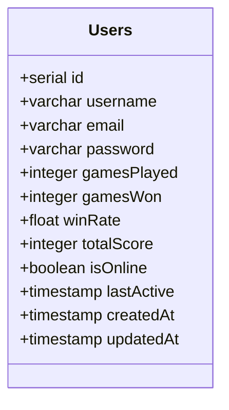

## Rooms Table

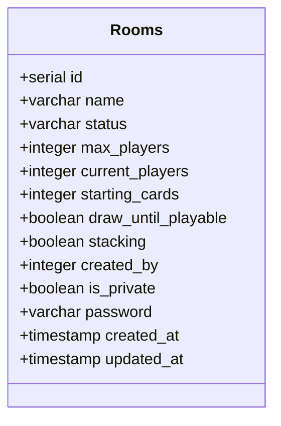

## Games Table

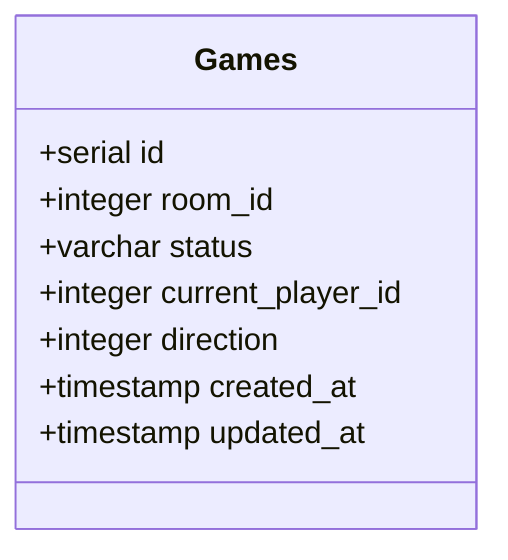

## Game State Table

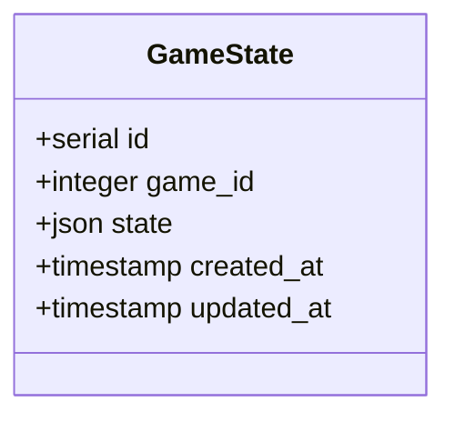

## Player Hand Table

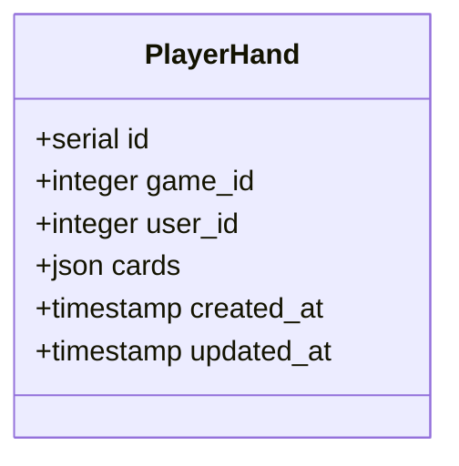

## Messages Table

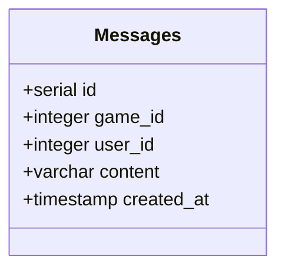

## Room Users Table

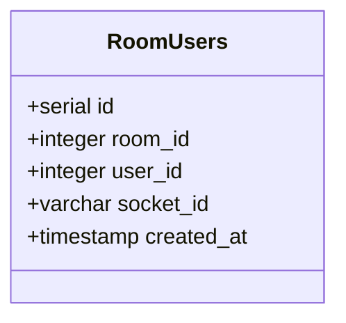

## Game Users Table

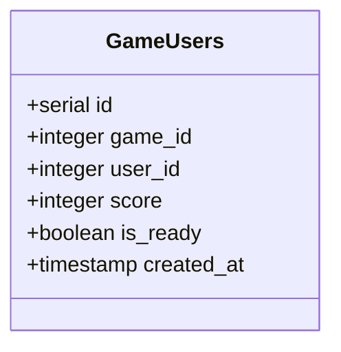

## Cards Table

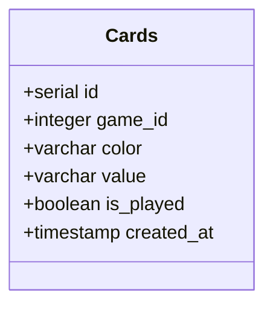

## Table Relationships

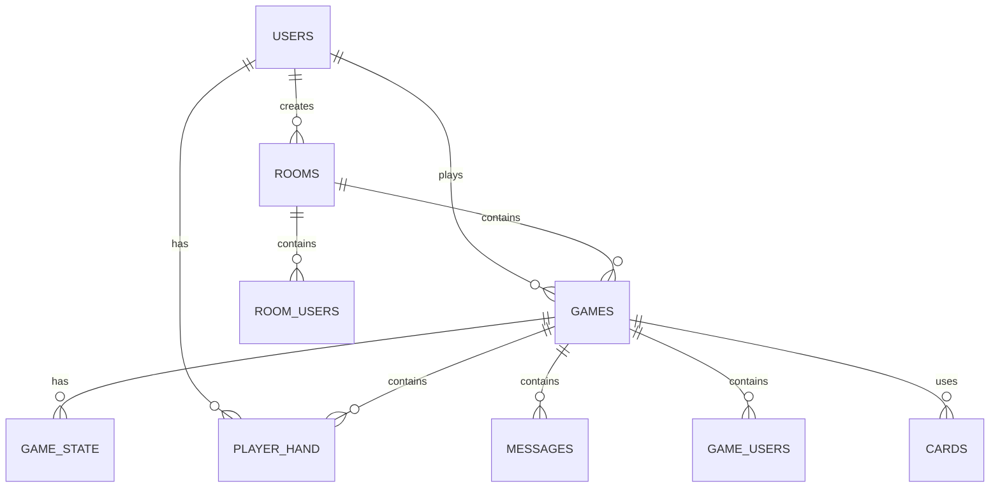

## Data Flow

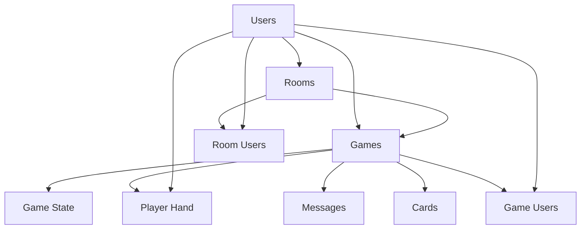
